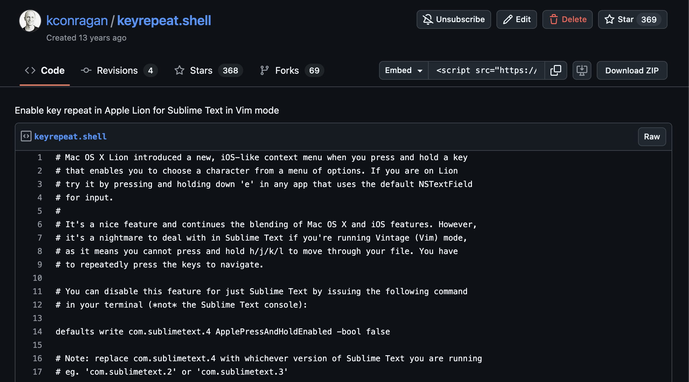

I was cleaning up some repos in GitHub and came across an [old gist I created back in 2012](https://gist.github.com/kconragan/2510186/revisions).

Honestly, I'd completely forgotten about it! Back then, [Sublime Text](https://www.sublimetext.com/) was my IDE of choice, but I had recently started using Vim motions. I wasn't quite ready to embrace [MacVim](https://macvim-dev.github.io/macvim/) or the terminal as my full-time coding environment, though.

When Apple released [macOS X Lion](https://www.apple.com/newsroom/2011/07/20Mac-OS-X-Lion-Available-Today-From-the-Mac-App-Store/), they introduced an iOS-like context menu that appeared when you pressed and held a key. As a designer, I understood this was another step in bringing macOS and iOS closer together in terms of user experience. But it was painful if you were a designer clumsily making his way through Vim like me. After digging around online, I figured out how to disable this context menu for Sublime Text and documented it in a Gist for posterity. Honestly, I didn't think about it again.

Turns out, that Gist has been starred almost 400 times and has over 100 comments from people offering their thanks.

First, thank you to all the commenters! Seriously, I can't tell you how good it feels to know it helped so many people facing a similar challenge.

But it also goes to show the power of learning in public. I didn't create that Gist for eyeballs or traffic. I genuinely just made it to document what I had learned. I've come to realize that even seemingly insignificant things are worth documenting. What might be obvious to you after hours of research could be a revelation to someone else. By sharing our knowledge, we create a collective resource that benefits everyone. You never know when your learning journey can aid the person just behind you. And this is the beauty of the internet.
