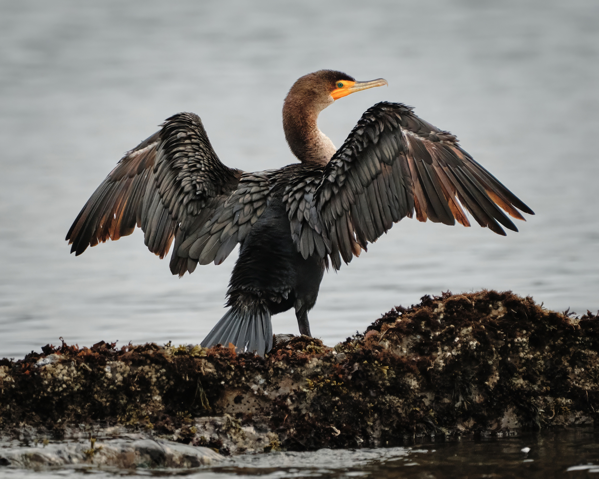
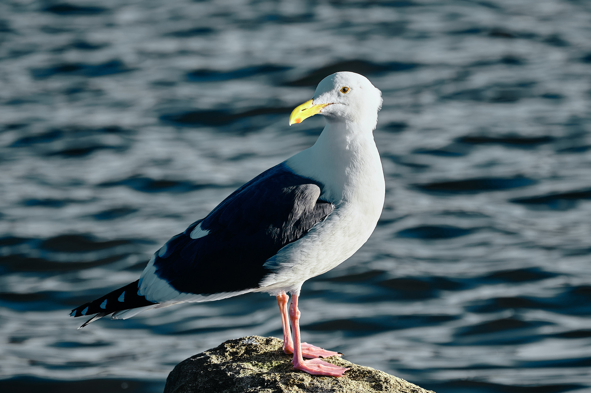

Growing up in Half Moon Bay, I've spent an a lot of time near Pillar Point looking for waves because some of my favorite surf spots are in the area. More recently, I've been returning here not just for waves, but for photos of the incredible sea life.

Pillar Point is a photographer's paradise. It's almost impossible to leave empty-handed, whether you're capturing the vibrant flashes of migrating songbirds or the patient stalking of a Marsh Owl amid the reeds. Salty waters teem with playful grebes and loons, while mudflats become bustling stages for sandpipers and plovers. Hawks and ospreys soar high above, casting watchful eyes on the scene below.

*A quick disclaimer: I am not a bird expert, nor an expert bird photographer. However, I have had success photographing here, so hope this guide is helpful for the next photographer. Did I miss anything? I'd love to hear from you if you!*

## The best time to photograph

Truth be told, Pillar Point offers photographic opportunities year-round, at almost any time of day. Don't worry if your schedule isn't flexible; just show up, and the birds will provide the show.

My favorite time is early morning, arriving just after sunrise. The wind tends to be calmest then, and the birds are most active. Early mornings also bathe the scene in warm light, enriching your photos, or offering the chance to capture silhouettes as the sun crests over the coastal mountains.

Late afternoon and sunset can be equally rewarding in terms of bird activity and light, though stronger winds can make reflective water shots a bit trickier.

If possible, plan your visit around low tide. Exposed mudflats attract shorebirds and wading birds feasting on crustaceans and mollusks, while the receding water reveals fascinating sand patterns and textures, adding visual interest to your shots.

Finally, Pillar Point can get foggy, especially in summer. Embrace it! It diffuses harsh light and eliminates harsh shadows (though vibrant colors might take a backseat). To compensate for the lower light, you'll need to bump up your ISO (more on camera settings later).

## Where to photograph

Honestly, everywhere.

1. **The marsh:** This crown jewel, fed by both fresh and saltwater, lies right before the parking lot as you enter from West Point Avenue. Keep your eyes peeled for Great Blue Herons, Snowy Egrets, and Common Loons, but be prepared for surprises!
2. **The parking lot:** Don't underestimate the little guys! Plants and bushes surrounding the lot attract a surprising number of smaller birds, from Red-Winged Blackbirds and Barn Swallows to Western Sandpipers, Blue Jays, Warblers, and many more.
3. **Along the shoreline (South):** Look for this spot on Google Maps as "West Shoreline Access." Scan the shoreline for a vibrant cast of characters, including Plovers of various stripes, Surf Scoters, Western Sandpipers, Dunlin, and more.
4. **The Breakwater (Mavericks Beach):** Caution: rough winter swells make this area dangerous. But on a calm, low-tide day, it's a treasure trove! Birds rest on rocks and in shallows, offering close-up opportunities. Expect California Gulls, Common Loons, Double-crested Cormorants, Snowy Egrets, and more.
5. **Up along the bluffs** The bluffs are ideal for capturing birds in flight and even getting a literal birds-eye vantage of Pelicans, Gulls, and birds of prey like Hawks and Ospreys.

## Photography gear and tips

A full walkthrough of how to photograph birds is far beyond the scope of this post. If you are new to bird photography, I highly recommend watching the [YouTube channel of Simon d'Entremont](https://www.youtube.com/@simon_dentremont) to get started. However, here are some specific tips on what gear you'll need and ways to maximize your keeper rate:

1. **Bring a telephoto**. I shoot FujiFilm cameras, and my go-to lens is the [FujiFilm 70-300mm F4-5.6](https://www.amazon.com/Fujinon-XF70-300mmF4-5-6-LM-OIS-WR/dp/B08TMZ59ZW?&_encoding=UTF8&tag=kconragan-20&linkCode=ur2&linkId=3cd182c323769f59703424b8187020b2&camp=1789&creative=9325). On my APS-C camera, this translates to an effective focal length of 105–450mm, which usually suffices. However, even this necessitates some post-processing cropping. Ultimately, the longer your lens, the better.
2. **Use a fast shutter speed**. For perched birds, 1/500th of a second is the minimum recommended shutter speed. To capture birds in flight, particularly takeoffs and landings, aim for at least 1/1000th of a second, ideally exceeding 1/2000th. Recall the earlier mention of fog reducing light; faster shutter speeds will require higher ISO settings. My setup involves setting the lens to its lowest aperture (f4.5–5.6 in my case) and the highest achievable shutter speed. Due to the area's variable light, I recommend Auto ISO. This allows setting your preferred aperture and shutter speed while letting the camera manage exposure, freeing you to focus on composition.
3. **Bring extra batteries**. While battery life depends on your camera model, bird photography often utilizes continuous autofocus and high-speed burst modes, notorious for draining batteries. Carrying two or three spares is advisable. I've personally had to return to my car for recharging batteries on more than one occassion.
4. **Bring a lens cloth**. Misty fog and salty spray, especially near the shoreline and breakwater, make airborne moisture a constant. Pack an absorbent lens cloth to keep your glass clear and ready for action.

Remember, the key to success here is simple: show up, observe, and be patient. Every visit to Pillar Point brings unexpected photographic opportunities, which is part of the magic. With over 20% of California's bird species calling this place home, its diversity ensures a rewarding visit each time I go.