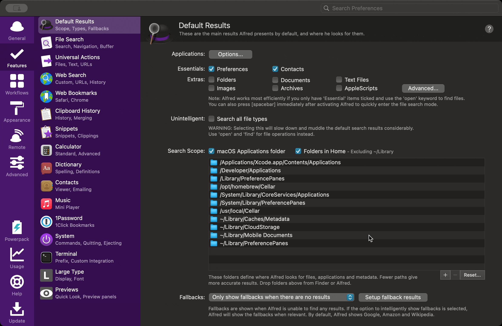

One of the unique advantages of using Capture One is its concept of Sessions, which doesn’t exist in alternatives like Adobe Lightroom. In my workflow I use both: Sessions for individual shoots, and Catalogs as a way to aggregate sessions and photos.

What I particularly like about Sessions is they are directly tied to the filesystem. Each Session gets its own dedicated directory for all the images, adjustments, and metadata. For me this keeps things organized and integrates well with how I already manage my photos and back up system to my NAS. I still use catalogs but the majority of my photoshoots start as Sessions, and then I use catalogs to aggregate across them.

However, one of the drawbacks of Sessions, especially as you get more than a handful, is retrieving them. Spotlight doesn’t index Capture One Sessions (or catalogs) by default, so you’re really left with navigating your folders manually. Enter Alfred.

I’m a big fan of launchers, dating back to Launchbar and Quicksilver. Most recently I use Alfred. Here’s how I’ve set it up so you can retrieve your Capture One Sessions through Alfred.

## 1. Tell Alfred about Capture One



First, Alfred needs to know what a Capture One session file is:

- Open Alfred's Preferences (⌘,).
- Go to **Features > Default Results**.
- Click **Advanced…**
- Click the **+** button to add a new user-defined file type
- Enter `.cosessiondb` and click **Close**

## 2. Include Your External Drives

Note: you can skip this step if you store your photos on your Mac’s internal drive.

I store my images on an external SSD. But Spotlight (which Alfred uses for indexing) doesn't always index external drives. Here's the fix:

- Open **Terminal** (Applications > Utilities > Terminal).
- Paste in this command, replacing `/Volumes/MyPhotoDrive` with the name of your drive:
  ```bash
  sudo mdutil -i on /Volumes/MyPhotoDrive
  ```
- Hit Enter, type in your password, and you're done!

## 3. Expand Alfred's Search

If Alfred isn’t setup already to do so, ensure your the parent folder where you store all of your photos is part of the default search scope. You don’t need to do this if your photos are stored in your default home directory.

- Go back to **Alfred Preferences > Features > Default Results > Search Scope**, and click the **"+"** button.
- Choose the folder where all your photography projects are stored.

**That's it!** Note: it will take a few minutes (or hours depending on the size of your index) for Spotlight to index the new files.

Now, when I need a session, I just open Alfred (⌘ + Space), type space to trigger a file search, type part of the session name, and hit Enter. Alfred launches Capture One and opens the session.

This is a fairly obvious solution in retrospect, but hopefully it helps!
