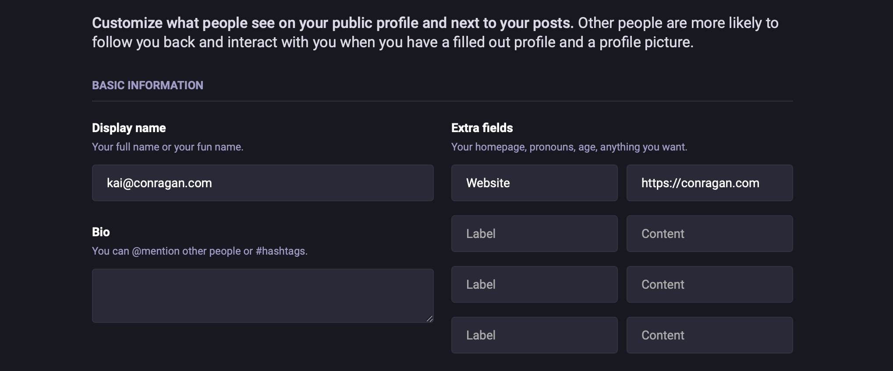

In 2025, many people (myself included) are looking at how they can break-free of dependencies on large tech companies owning their data and providing the algorithms that decide what content they see. Enter the Fediverse. A catchy way to refer to a common set of protocols (really, [ActivityPub](https://activitypub.rocks)) [^1] and an independent but connected set of servers that can speak to each other through these protocols, thus creating a “decentralized” content ecosystem.

This weekend, I took my first steps to getting my website connected to the Fediverse, [Mastodon](https://joinmastodon.org) in this case (currently one of the most popular) I'll be documenting my progress in a series of blog posts, because even as someone comfortable with technology, I found it surprisingly challenging to get started. There's a lot of information out there, but it's often fragmented and assumes a level of technical expertise. While each individual step is relatively simple, figuring out _which_ steps to take, and in what order, can be surprisingly confusing.

In this first post, we’ll be focusing on two key steps to establishing your presence on the Fediverse: verifying that your website and Mastodon profile belong to the same person, and setting up your domain as your Fediverse handle

## Claiming Your Fediverse Identity With rel="me" Links

Everyone is familiar with a *handle*. You have one. It’s the username you pick when you sign up for anything from Gmail to Instagram to Twitter. If you are lucky or creative, you have a consistent handle across various services. More or less, mine is *kconragan* wherever I go. I’m lucky in that I don’t believe there is another Kai Conragan on the planet. At least, I’ve never heard of or met one. If you are one, say hi! But I digress.

There are at least two problems with relying on a 3rd party for your handle. First, no matter what you do, it might just not be available because someone has already chosen it. That sucks for keeping your identity consistent and _discoverable_ across services. Second, that service owns your handle. It’s not just *kconragan*, it’s *kconragan* on Instagram. Or Twitter, or YouTube, or TikTok. You get the point.

If you’ve signed up for Mastodon, you already picked a handle, one that is tied to the Mastodon server you registered with (for example, `mastodon.social` is the most popular server at the time of this writing).  The good news is that the Fediverse is designed for cross-server communication. Even if someone registers on a different Mastodon server (like `mastodon.lol`), they can still follow and interact with you.

But one of the beautiful things about the Fediverse is that you can own, independent of any 3rd party service, your own handle. Your identity on the web. It can be based on a domain you own, taking the form of `you@yourdomain.com`. Think of it like having a personalized email address for the social web – it’s unique to you and nobody else can claim it.

### Step 1: Linking From Your Website To Mastodon

This tells the Fediverse, "This website belongs to the same person as this Mastodon profile."

1. **Decide Where to Put the Link:** Choose where on your website you want to link to your Mastodon profile. Common places are your homepage, "About" page, footer, or a dedicated social links section. The most important thing is that it's on a page that you'll link to from your Mastodon profile in the next step.
   
2. **Add the `rel="me"` Link:** Add a normal link to your Mastodon profile, but include the `rel="me"` attribute. Here's the HTML code:
    ```
    <a rel="me" href="https://mastodon.social/@yourusername">Mastodon</a>
    ```
    Replace `https://mastodon.social/@yourusername` with your Mastodon profile URL.
    
    You can change the text "Mastodon" to anything you want (e.g., "Follow me on Mastodon," your Mastodon handle, or an icon).
    
3. **Save and Publish:** Save the changes to your website and publish them

### Step 2: Linking _From_ Your Mastodon Profile _To_ Your Website

Now we need to do the reverse: link _from_ your Mastodon profile _back_ to your website. This creates a _two-way_verification, confirming that you control both.

1. **Edit Your Mastodon Profile:**
    - Go to your Mastodon profile on your instance (e.g., [`https://mastodon.social/@kconragan`](https://mastodon.social/@kconragan)).
    - Click the "Edit Profile" button (the exact wording might vary slightly).
    - Find the "Profile Metadata" section. This is where you can add custom fields.
    - Add a new field and enter your website's URL (ideally a link to your "About" page). You can label it "Website," "Homepage," "My Site," or something similar. The label itself doesn't affect the verification.
    - Add your Fediverse handle (`kai@conragan.com`) to your Mastodon _bio_.
    - Save your profile changes.



2. Go to your server (e.g., [mastodon.social](https://mastodon.social)).

	- Navigate to your profile page (e.g. [https://mastodon.social/@kconragan](https://mastodon.social/@kconragan))
	-  Click "Edit Profile." (or something similar depending on your server)
	-  Here you’ll see various profile metadata you can add extra information about yourself. One of the options will be adding links to elsewhere on the web that you want people to visit. Here, enter your website (the url that holds the `rel=me` link you just made). You can label it whatever you want, the only thing that matters is that the URL points to your new identified webpage.
	-  Click “Save Changes”

That’s it, time to check if it worked!

### Step 3 (Verification - Troubleshooting)

If everything is set up correctly, Mastodon will automatically detect the `rel="me"` links and display a green checkmark next to your website link in your profile. This is the visual confirmation that the connection has been made. Huzzah!

**Troubleshooting:**

- **Wait:** It can sometimes take a while (even a few hours) for Mastodon to update its information. Be patient, and check again later.
- **Typos:** Double-check for any typos in the URL you added to your Mastodon profile and in the `href` attribute of the `rel="me"` link on your website.
- **Other Attributes (Rare Issue):** In some _rare_ cases, other attributes on the `<a>` tag _might_ interfere with Mastodon's ability to recognize the `rel="me"` link. If you're still having trouble, try temporarily removing any other attributes (like `aria-label` or `class`) from the link, just to see if that helps.
- **Use the Debugger:** The Mastodon Link Debugger (made by Rob Cannon) is a fantastic tool for diagnosing issues: [https://mastodon-link-debugger.vercel.app/](https://www.google.com/search?q=https://www.google.com/url%3Fsa%3DE%26source%3Dgmail%26q%3Dhttps://mastodon-link-debugger.vercel.app/). Enter your Mastodon profile URL, and it will show you any problems it finds.

Hopefully by now you’ve got a green checkmark! With our identify verified, we can move to making ourselves discoverable. To do this, we will set up what is known as WebFinger

## Telling The Fediverse You Exist

[^1]: really cool stuff here guys
