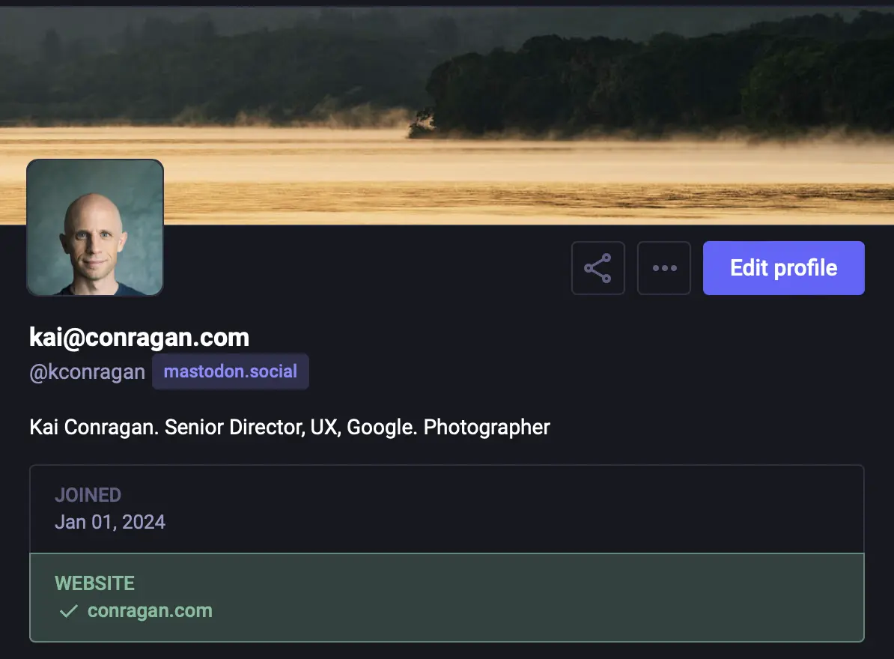

I’m exploring ways to make my online presence feel more like [my home](https://nazhamid.com/journal/your-site-is-a-home/) and less like a rented space on someone else’s platform. The convenience of the big social networks came with a hidden cost: a loss of ownership and control. This _loss_ is something long-time blogger and technologist [Matt Webb captured in a recent post commemorating 25(!) years of publishing to his site](https://interconnected.org/home/2025/02/19/reflections):

> Slowly, slowly, the web was taken over by platforms. Your feeling of success is based on your platform’s algorithm, which may not have your interests at heart. Feeding your words to a platform is a vote for its values, whether you like it or not. And they roach-motel you by owning your audience, making you feel that it’s a good trade because you get “discovery.”

Enter the Fediverse. Not just an alternative to the centralized model; it represents a fundamental change. It’s not about building another centralized platform, but about fostering a modular, interconnected network. Built on open protocols like ActivityPub, the Fediverse allows independent servers to communicate directly. This serves the purpose of still facilitating content discovery and relationship connections while empowering individuals to own and control their own identities and data.

It’s a return to the original spirit of the open web while embracing what we learned about discovery and reach of the large platforms.

Hoping to pass it forward, I thought I would document my progress in a series of posts because, even as someone comfortable with technology (though not an expert), I found getting started challenging. (I have lots of thoughts on how broken the UX is for the open-web, but that’s for another post). There’s a lot of information out there, but it’s often fragmented and assumes a level of technical expertise. While each individual step is simple, figuring out _which_ steps to take, and in what order, can be confusing.

To start we’ll focus on two key steps in establishing presence in the Fediverse:

1. Connecting your website and Mastodon profile so the Fediverse knows they are the same person.
2. Setting up your domain for use as your Fediverse handle.

## Claiming Your Fediverse Identity With rel="me" Links

If you’ve signed up for Mastodon, you already picked a handle, one that is tied to the Mastodon server you registered with (for example, `mastodon.social` is the most popular server at the time of this writing).  The good news is that the Fediverse is designed for cross-server communication. Even if someone registers on a different Mastodon server (like `mastodon.lol`), they can still follow and interact with you.

But one of the beautiful things about the Fediverse is that you can own, independent of any 3rd party service, your own handle. Your identity on the web. It can be based on a domain you own, taking the form of `you@yourdomain.com`. Think of it like having a personalized email address for the social web – it’s unique to you and nobody else can claim it.

### Step 1: Linking From Your Website To Mastodon

This tells the Fediverse, "This website belongs to the same person as this Mastodon profile."

1. **Decide Where to Put the Link:** Choose where on your website you want to link to your Mastodon profile. Common places are your homepage, "About" page, footer, or a dedicated social links section. The most important thing is that it's on a page that you'll link to from your Mastodon profile in the next step.
   
2. **Add the `rel="me"` Link:** Add a normal link to your Mastodon profile, but include the `rel="me"` attribute. Here's the HTML code:
    ```html
    <a rel="me" href="https://mastodon.social/@yourusername">Mastodon</a>
    ```
    Replace `https://mastodon.social/@yourusername` with your Mastodon profile URL.
    
    You can change the text "Mastodon" to anything you want (e.g., "Follow me on Mastodon," your Mastodon handle, or an icon).
    
3. **Save and Publish:** Save the changes to your website and publish them

### Step 2: Linking _From_ Your Mastodon Profile _To_ Your Website

Now we need to do the reverse: link _from_ your Mastodon profile _back_ to your website. This creates a *two-way verification*, confirming that you control both.

1. **Edit Your Mastodon Profile:**
    - Go to your Mastodon profile on your instance (e.g., [`https://mastodon.social/@kconragan`](https://mastodon.social/@kconragan)).
    - Click the "Edit Profile" button (the exact wording might vary slightly).
    - Find the "Profile Metadata" section. This is where you can add custom fields.
    - Add a new field and enter your website's URL (ideally a link to your "About" page). You can label it "Website," "Homepage," "My Site," or something similar. The label itself doesn't affect the verification.
    - Add your Fediverse handle (`kai@conragan.com`) to your Mastodon _bio_.
    - Save your profile changes.


2. Go to your server (e.g., [mastodon.social](https://mastodon.social)).

	- Navigate to your profile page (e.g. [https://mastodon.social/@kconragan](https://mastodon.social/@kconragan))
	-  Click "Edit Profile." (or something similar depending on your server)
	-  Here you’ll see various profile metadata you can add extra information about yourself. One of the options will be adding links to elsewhere on the web that you want people to visit. Here, enter your website (the url that holds the `rel=me` link you just made). You can label it whatever you want, the only thing that matters is that the URL points to your new identified webpage.
	-  Click “Save Changes”

That’s it, time to check if it worked!

### Step 3 (Verification - Troubleshooting)

If everything is set up correctly, Mastodon will automatically detect the `rel="me"` links and display a green checkmark next to your website link in your profile. This is the visual confirmation that the connection has been made. Huzzah!



**Troubleshooting:**

- **Wait:** It can sometimes take a while (even a few hours) for Mastodon to update its information. Be patient, and check again later.
- **Typos:** Double-check for any typos in the URL you added to your Mastodon profile and in the `href` attribute of the `rel="me"` link on your website.
- **Other Attributes (Rare Issue):** In some _rare_ cases, other attributes on the `<a>` tag _might_ interfere with Mastodon's ability to recognize the `rel="me"` link. If you're still having trouble, try temporarily removing any other attributes (like `aria-label` or `class`) from the link, just to see if that helps.
- **Use the Debugger:** The Mastodon Link Debugger (made by Rob Cannon) is a fantastic tool for diagnosing issues: [https://mastodon-link-debugger.vercel.app/](https://mastodon-link-debugger.vercel.app/). Enter your Mastodon profile URL, and it will show you any problems it finds.

Hopefully by now you’ve got a green checkmark! With our identify verified, we can move to making ourselves discoverable. To do this, we will set up what is known as WebFinger

## Telling The Fediverse You Exist

The `rel="me"` links establish _verification_ – they prove you control both your website and your Mastodon profile. The next step is being able to use your own domain as your handle on the Fediverse. This allows you to use your own domain as your Fediverse handle, providing a consistent and memorable identity across services. Instead of relying on a platform-specific username, people can find you using the same address as your website.

For this, we need WebFinger. WebFinger is a simple protocol: it's a file, named `webfinger` (no extension), placed in a specific directory on your site – `.well-known` – resulting in a full path of `domain.com/.well-known/webfinger`. This file, formatted as JSON, acts as a directory lookup, translating your `you@domain.com` address into the underlying Mastodon account information.

The key pieces of information the `webfinger` file contains are:

- **`subject`:** This is your Fediverse address, in a special format that starts with `acct:`. For now, we'll use your _actual_Mastodon address (e.g., `acct:yourusername@yourmastodon.instance`).
- **`links`:** This is a list of places where Mastodon can find more information about you.
- **`rel="self"`**: This points to your official profile.

### Create Your WebFinger

To get you started, here is my WebFinger:

```javascript
{
  "subject": "acct:kconragan@mastodon.social",
  "aliases": [
    "https://mastodon.social/@kconragan",
    "https://mastodon.social/users/kconragan"
  ],
  "links": [
    {
      "rel": "http://webfinger.net/rel/profile-page",
      "type": "text/html",
      "href": "https://mastodon.social/@kconragan"
    },
    {
      "rel": "self",
      "type": "application/activity+json",
      "href": "https://mastodon.social/users/kconragan"
    },
    {
      "rel": "http://ostatus.org/schema/1.0/subscribe",
      "template": "https://mastodon.social/authorize_interaction?uri={uri}"
    }
  ]
}
```


Copy the code above, make the necessary replacements, and save the file as `webfinger` (with no extension) in your `static/.well-known/` directory. Once you've created and saved the `webfinger` file, deploy your changes to your website.

### Testing Your WebFinger Setup

After deploying, you need to verify that your WebFinger file is working correctly. Here are two ways to do that:

**1. Using `curl` (Command Line):**

Open your terminal and run the following command, replacing `yourusername` and `domain.com` with your _actual_information:

```bash
curl -H "Accept: application/jrd+json" 'https://domain.com/.well-known/webfinger?resource=acct:yourusername@domain.com
```

If everything is working, you should see output similar to the JSON code you pasted above, confirming that your WebFinger file is accessible and returns the correct information.

**2. Using an Online WebFinger Lookup Tool:**

You can also use a web service like [https://webfinger.net/lookup/](https://www.google.com/url?sa=E&source=gmail&q=https://webfinger.net/lookup/). Enter your full Fediverse address (`yourusername@domain.com`) and click "Lookup." The tool should show you the information from your WebFinger file.


### Success

With your WebFinger file in place and your rel="me" links configured, your website is now discoverable on Mastodon using your custom domain handle. Anyone searching for `username@domain.com` should be able to find your profile. If you've made it this far, congrats! You now have the foundation for managing your own identity across the Fediverse. If you have any questions, don't hesitate to email me (or better yet, reach out on Mastodon!). 


