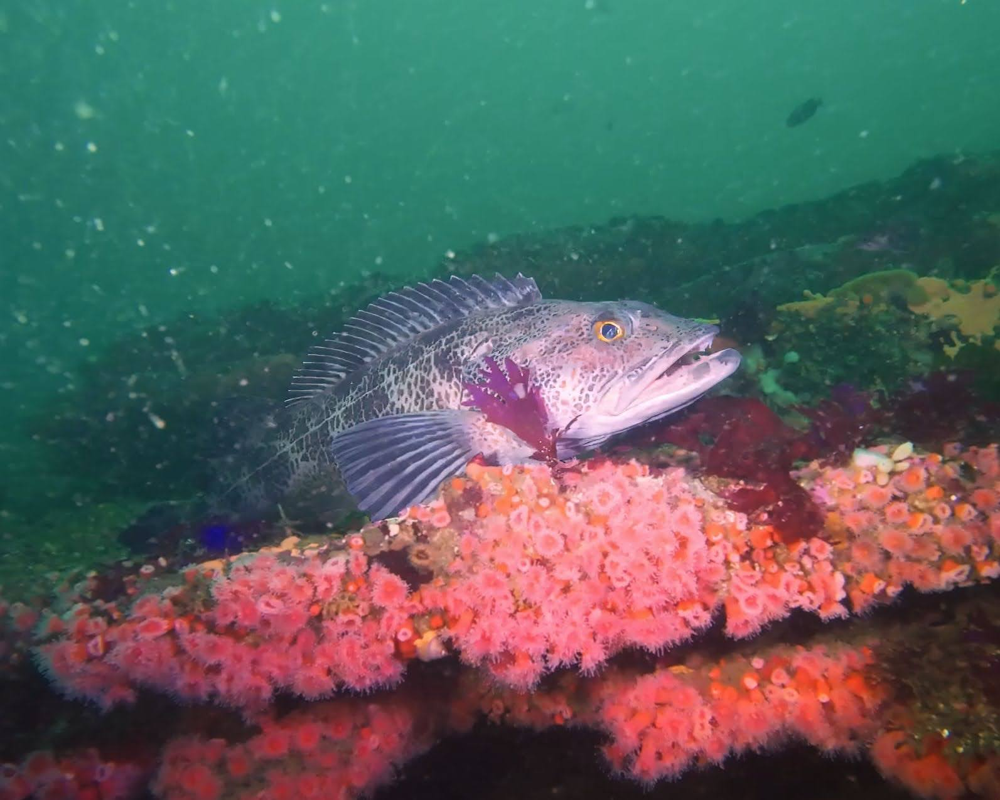

## Dive log

### Stats
- **Max Depth:** 21.3 m / 70 ft
- **Average Depth:** 17.8 m / 58 ft
- **Duration:** 46 minutes
- **Water Temp:** 12.0°C / 54°F
- **Gas:** EAN32
- **Tank(s):** HP100
- **Pressure Start:** 241 bar / 3500 psi
- **Pressure End:** 69 bar / 1000 psi
- **Surface Consumption Rate:** 16.28 L/min / 0.57 cf/min

### Notes
First dive of the day from the [Escapade](https://divecentral.com/) with [BAUE](https://www.baue.org/). We tried to make it around to Carmel but turned back to due larger than expected swells right at the navigational buoy marking Point Pinos. Oh well, we'll get there eventually. Had a more successful dive here than my first time around. Lots of Redfish (what a shock!), lincold, copper rockfish, vermillion rockfish, and more.
