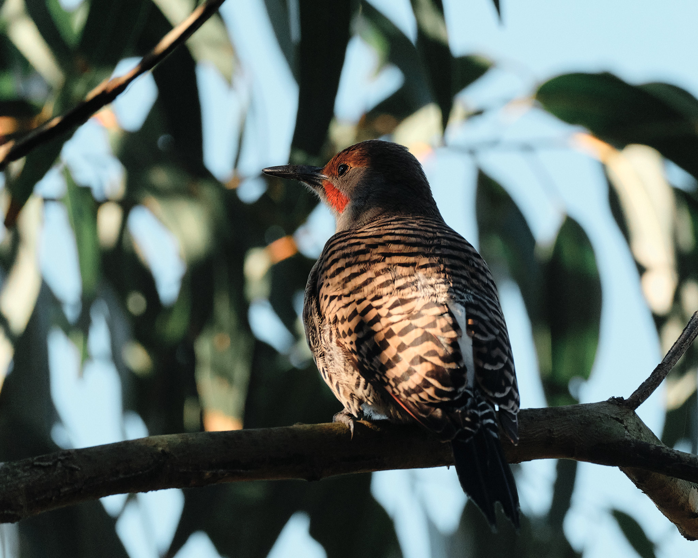
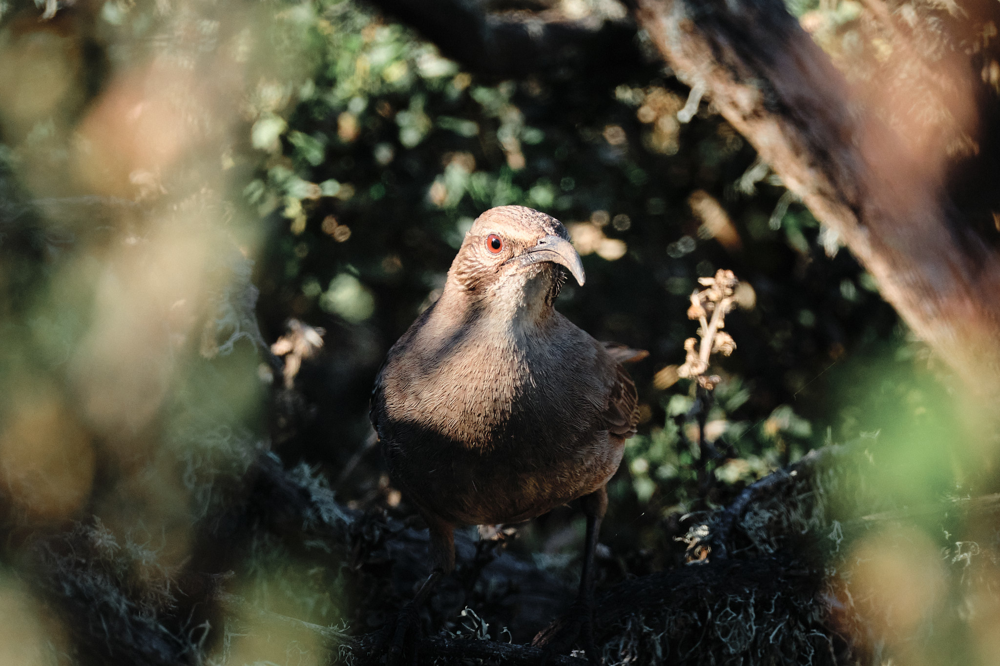
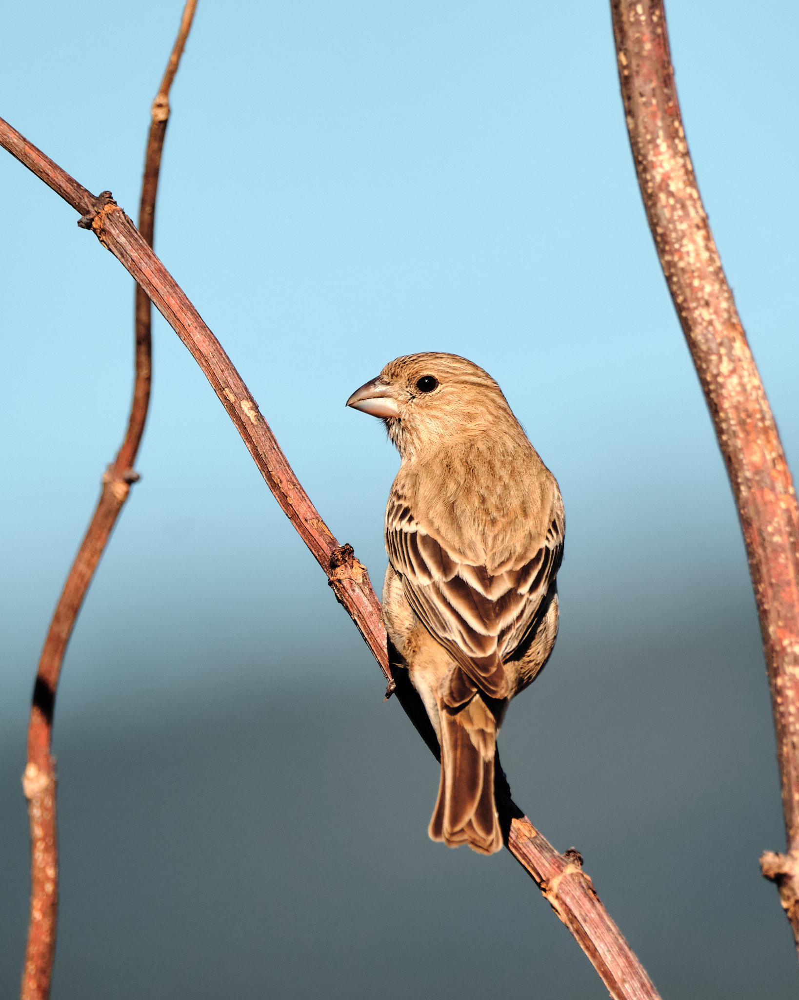
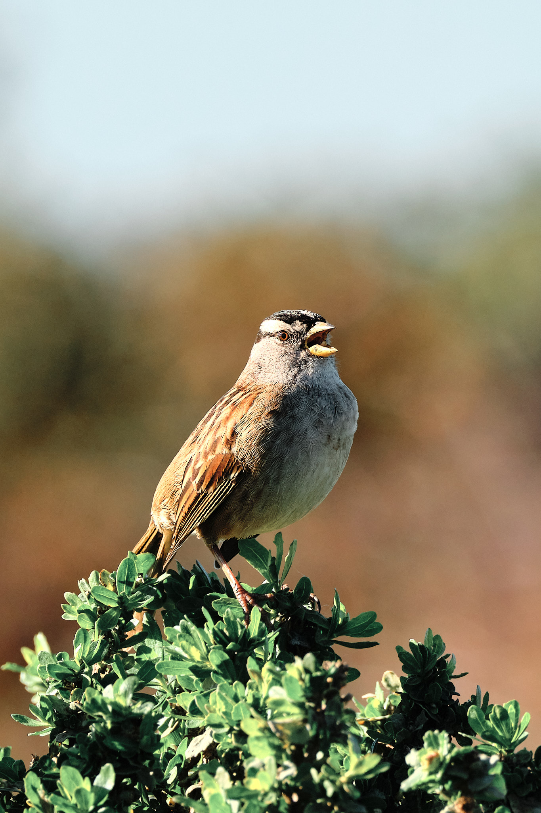

It's been a bit of a slow start to the year photographically. That's not a bad thing as a big part is due to our [recent trip to the Florida Keys](/blog/2025/diving-florida-keys-2024/) where we got to do a bunch of diving. Besides spending as much time as possible underwater, I also had a goal of making my [first short dive video](https://youtu.be/5W0FeY__CUY). I’m pretty happy with the results, but I’m equally eager to get some photos made this year.

With some time to kill this afternoon, I headed to one of my favorite places to see birds along the coast: the plot of land between Frenchman’s Creek and Dunes Beach in Half Moon Bay. I'm still a relatively inexperienced birder, which I honestly love as it means every outing I’m bound to experience something new by just paying attention. The beauty of the beginner’s mindset!

Along the dunes, you get the usual suspects: gulls, pelicans, and the occasional osprey soaring overhead. But move just a few steps inland, and the landscape changes quickly. Red-tailed hawks circle above the grasslands, while crows and ravens perch on fence posts. Closer to the forested area: hummingbirds dive-bombing from a favorite perch, sparrows throughout the underbrush, chickadees and warblers in the trees, and the occasional towhee as well.

One bird I've been wanting get a good picture of is the Northern Flicker, a member of the woodpecker family. I love the black-scalloped plumage and the flashes splashes of red and yellow. As luck would have it, I did spot a one, but unfortunately, I wasn't able to get a real keeper image. Flicker tend to like to hide out, either in the underbrush or in branches overhead. This one was perched in a branch that prevented me from getting a clean background, and the dappled light was difficult to get the whole bird illuminated. Patience and persistence is the name of the game, but here is an image nonetheless.

Nearby, I came across a California Thrasher amongst the coastal shrubs. These guys also love to hide out. I’ve previously gotten a shot of one perched, but I kind of like how the out-of-focus branches frame this one.

I also found a female Common House Finch. While the females lack the vibrant red plumage of the males, the soft blue-to-green ombre background provides a nice contrast to the warm browns.

And of course, you can always find the ever-present Song Sparrows and White-Crowned Sparrows.

All images here were shot on my FujiFilm X-H2s with the 150-600mm f/5.6-8 lens.
