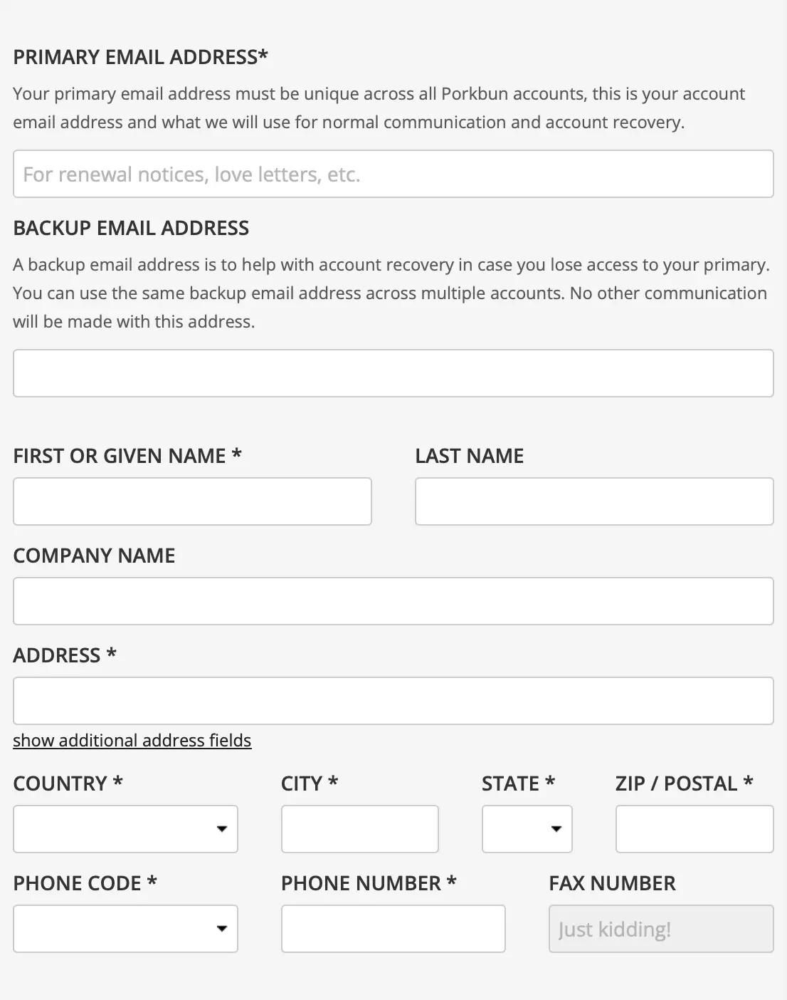

I recently transferred my domain `conragan.com` from GoDaddy to [Porkbun](https://porkbun.com). During the registration process, I came across a small detail that made me laugh out loud:

I'm old enough to remember when domain transfers meant using a fax machine. It was terrifying. Even though I still find fax technology more magical than the internet, the transfer process could take days or weeks, with no feedback and no guarantee of success. Clearly, someone at Porkbun remembers those days, too.

As an aside: I miss [Little Big Details](https://littlebigdetails.com/), a great little site that let users submit delightful little UX moments they encountered on the web. I just checked their RSS feed and the site hasn’t been updated since 2017. 
