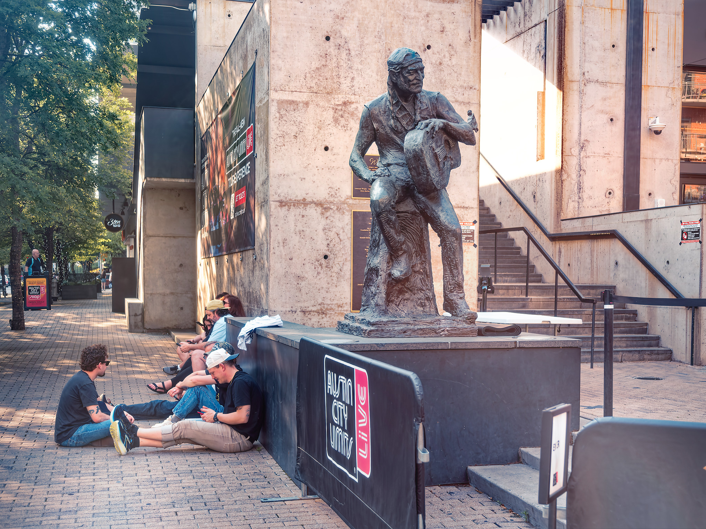
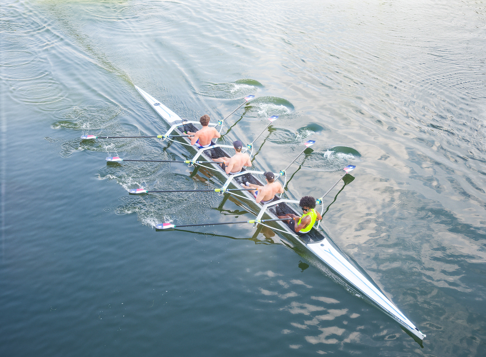
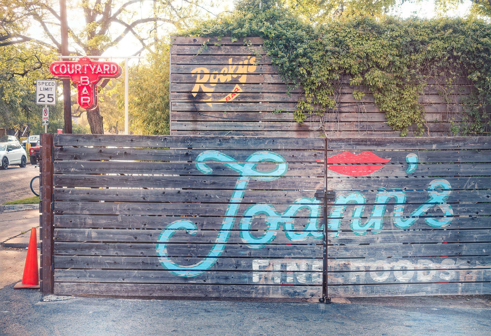
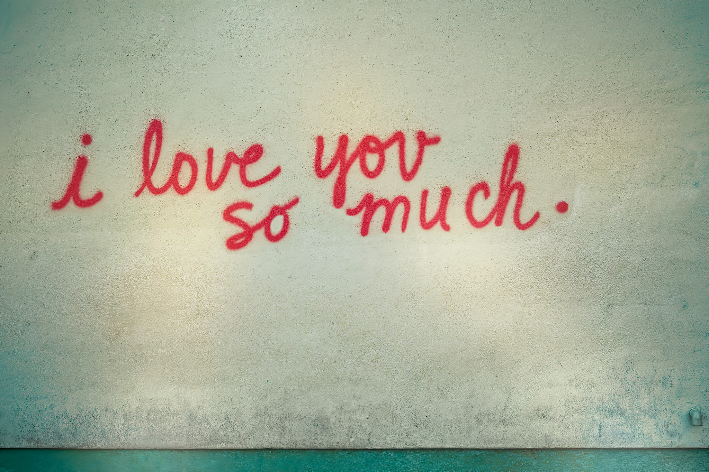
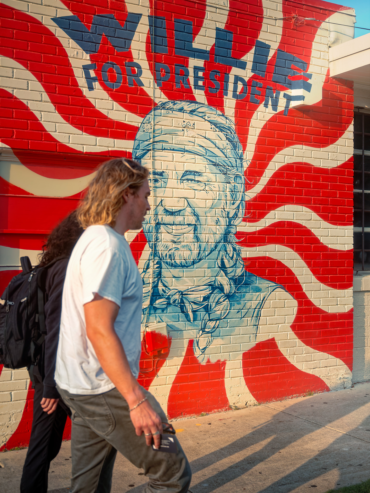

This past week I was in Austin, TX for a work event. Beyond work, I had the opportunity to participate in a fireside chat with the graduating class from the [University of Texas at Austin - The School of Design and Creative Technologies](https://designcreativetech.utexas.edu/). It's always inspiring to get to talk with the next generation of designers.

I also had a chance to walk around the city as it was my first time there. A few photos (shot with my FujiFilm X-T3).

