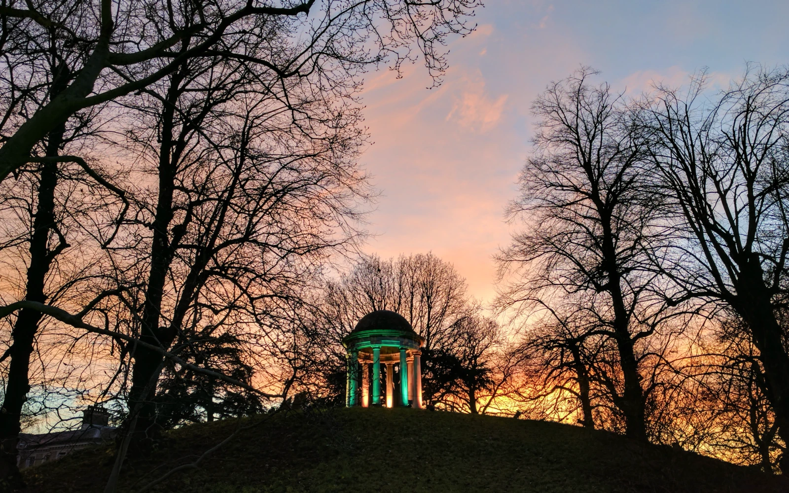
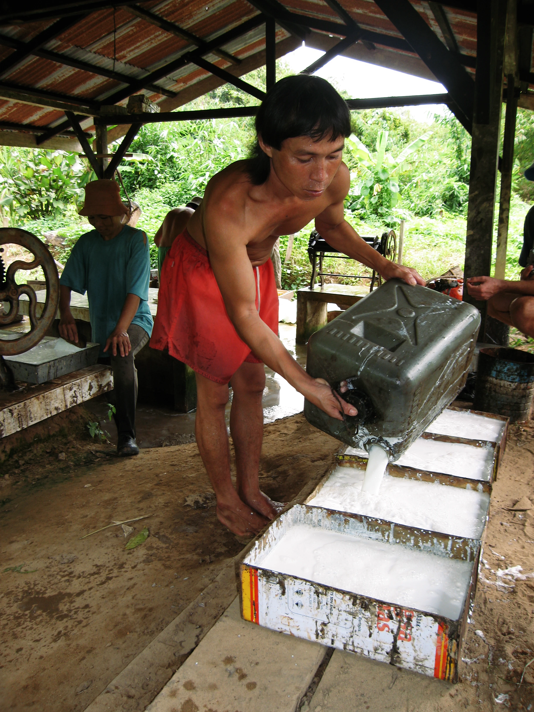

My friend Joël recently shared the [Empire podcast](https://empirepod.supportingcast.fm/) with me (which I was unfamiliar with) and an episode in particular: [Empire of Plants: From Kew Gardens to Botany Bay](https://pod.link/1639561921/episode/ebcd9f4b23c3d45037b0618b6586f82b). Anita Anand and William Dalrymple in conversation with Sathnam Sanghera discuss the history of botanic gardens and their role in colonialism.

As background, in 2016 Joël took my family and I to the Kew Gardens on a trip we had made to the UK. We had a lovely day there. It was near Christmas time and we brought my then 4-year old daughter to explore. During the winter holidays, Kew Gardens put together a spectacular light show that adds a touch of magic to a place already rich to the senses: giant palms housed in Victorian glass, oversized lily pads floating on ponds, flowers spilling from manicured beds, and centuries old trees of so many varieties including black walnut, coastal redwood, mountain gum, and more. I have vivid memories of my daughter running playfully through the mature gardens, and watching into the sunset as the holiday lights put on a magical show. The Kew Gardens are a testament to human curiosity in the natural world and commitment to continued study of it’s beauty and diversity.

But it also speaks to the complex and troubling history of British Colonialism, and how botany was a powerful tool for their empire. I was admittedly unaware of this aspect on our visit there. The podcast did a good job of framing how, in the economic exploitation of Britain's colonies, Kew played a central role, with its scientists working to cultivate and transport valuable plants like rubber and quinine, often with devastating consequences for indigenous communities.

The rubber industry in Malay particularly resonated with me as, in 2006–2007 I spent the better part of a year living in Borneo and saw the legacy of the rubber trees introduced by British colonists.

My experience in Borneo, witnessing the lasting impact of the rubber trade, brought this complex history into sharp focus. History, including that of Kew Gardens, is often complex, a story of human curiosity and cruelty, beauty and barbarism. It seems they are now grappling with this legacy, quoting from [an article on their own website](https://www.kew.org/read-and-watch/kew-empire-indigo-factory-model):

> Currently, Kew is in the middle of a journey; we are looking at our language, our collections, our scientific practices, our policies, and the histories we do and don’t tell about Kew’s entanglement with the British Empire.…In the words of the museum's founder Sir William Hooker, our purpose was to show plants and ‘the uses which the ingenuity of man has derived from them’ – and to harness them at quite a cost

Thanks for the share, Joël!
